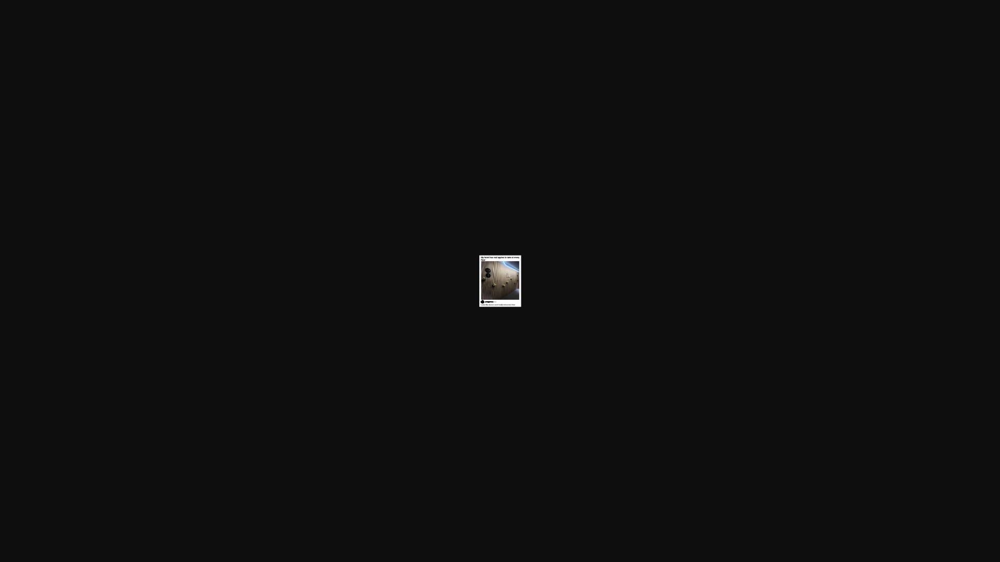

# Apples 1

Who posted this photo? 

Flag format: ClawCTF{TitleCase}

Solution

Reverse search the small part of the image and you find a reddit link to a post. It has the author mentioned there.
Flag: ClawCTF{YoungstownTrash}

# Apples 2

What’s the name of this hotel?

Flag format: ClawCTF{TitleCase}

Solution

You also get the hotel's name while reverse searching the image.
Flag: ClawCTF{Hôtel_Le_Germain_Montréal}

