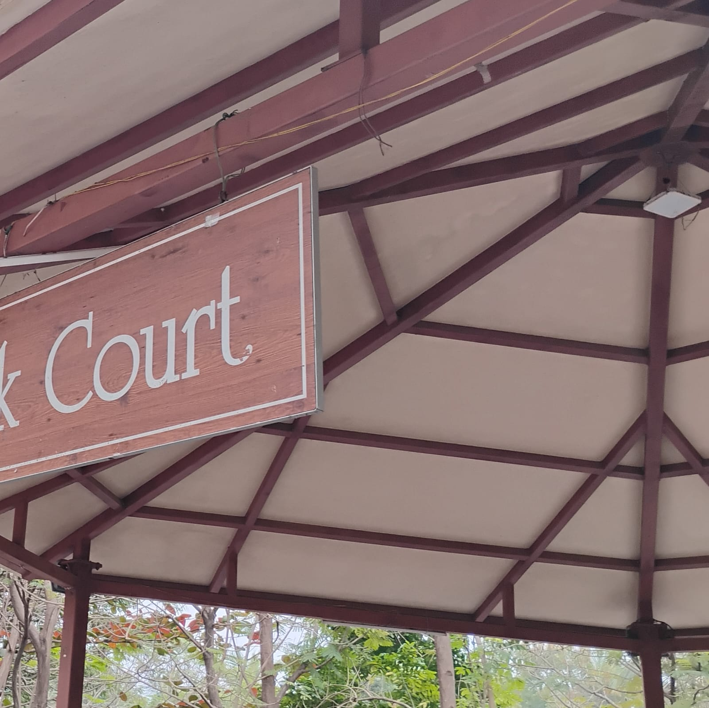

# Gazebo

Find the coordinates of this place.

Flag format: ClawCTF{latitude_longitude}

Solution

We can see that the image ends with k Court.
Find words that end with k and try searching in google maps.
The name of the place is Clock Court and it's located in VIT Chennai opposite to the Gazebo as given in the title.
Flag: ^ClawCTF\{12\.8411\d*_80\.1543\d*\}$

