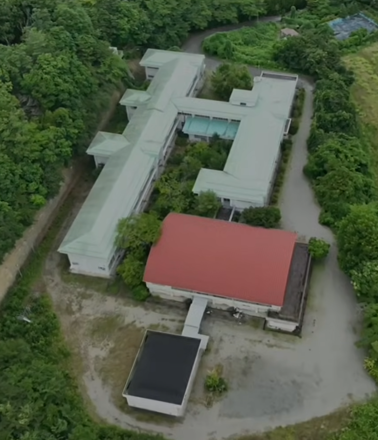
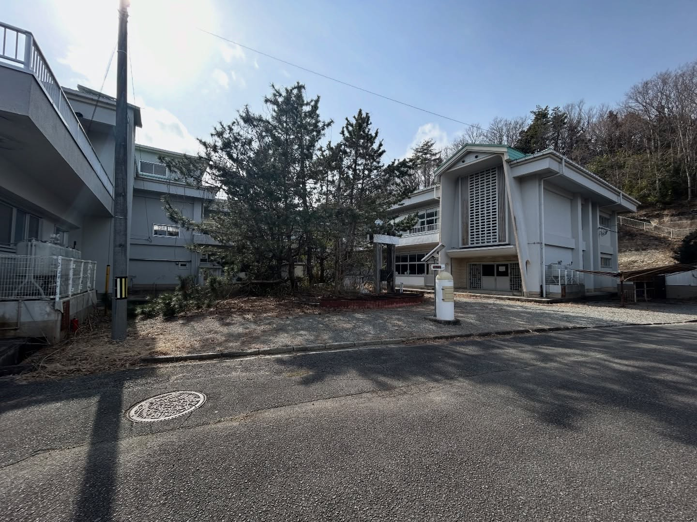

# URBEX
About a year ago, an urbexer visited an exclusion region abandoned in 2011 and found something paranormal. \
Another paid a visit to the same place and was disappointed.\
What was the place that they visited?\
Flag Format: ClawCTF{Place_Name}

Solution

The first urbexer was places_forgotten on instagram.

https://www.instagram.com/p/C_YLv6ioxah/?hl=en&img_index=5

The second urbexers were 2swag.productions and decayingmidwest on youtube.

https://youtu.be/gDtknyX2p1w?si=dYX_Ngs_zDUv9R4e

Reverse search this image and find similar images

https://www.facebook.com/APHS.URBEX/posts/exploring-a-school-in-fukushima-japan-abandoned-since-2011-abandoned-abandoned_p/1265161462303492/

Reverse search this image again and you get the name.

https://www.facebook.com/Lostplacesandforgottenfaces/posts/futabaminami-elementary-school%EF%B8%8F-fukushima-japan-%EF%B8%8Fexplore-807____________________/719520640214159/

Flag: ClawCTF{Futabaminami_Elementary_School}

